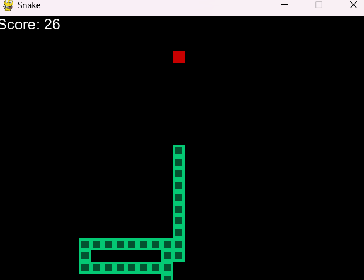
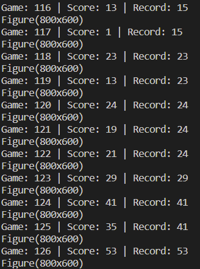

# Snake-Reinforcement-Learning
Deep Q Learning Artificial Intelligence on a Snake Game by Reinforcement using `Python`, `PyTorch` and `PyGame`. 

## Description:
This is an Artificial Intelligence developed in Python using Torch and Anaconda.
  It uses the well known Snake game as an environment to Train.
  The Deep Q Learning is supervised by a medium size Agent with neural network, and is trained on a written Model.
  We are rendering some scoring data using matplotlib graphs, and a high speed live game displayer. Of course, the speed can be changed.

## Instructions:
- Use Python version <= 3.9 as Pytorch does not fully support development on `Python 3.11` as of *25th Dec 2022*
- Install dependencies using [requirements](./requirements.txt)
- Execute `python agent.py` in terminal
- Let the Snake learn by itself using our `model.py`

## Additional Information:
- This AI project was made for learning and has been made with the help of [Snake AI-Pytorch](https://www.youtube.com/watch?v=PJl4iabBEz0) and uses a pre-released Snake game as the environment
